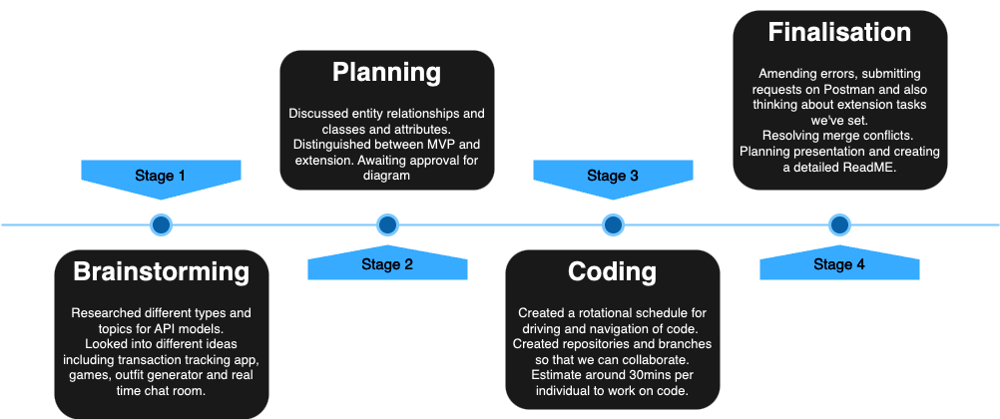
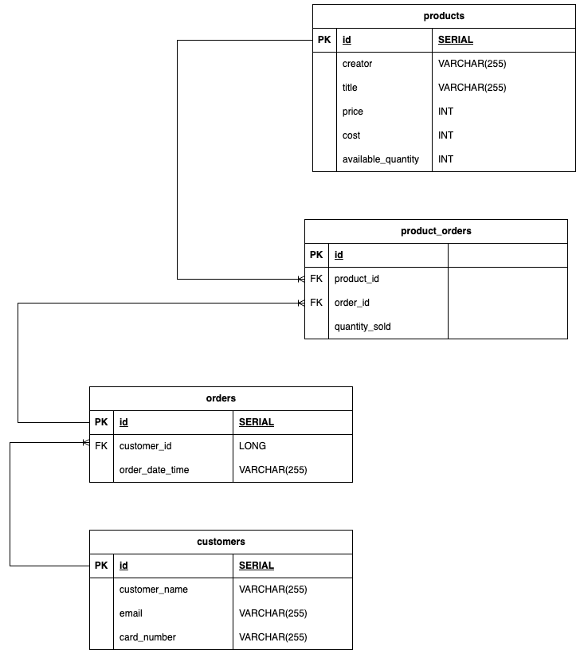
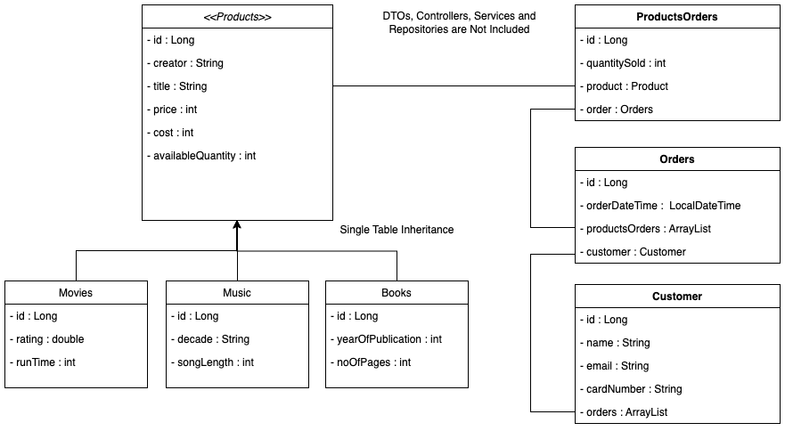

# **Backend Project (BNTA Week 7)**
## **List of collaborators**
**The following project is a collaboration effort between the following members on BNTA C11:**
- Blezzy Dela Cruz (Github: [blezzydcruz](https://github.com/blezzydcruz))
- Jannah Anwar (Github: [jannahthecodemaster](https://github.com/jannahthecodemaster))
- Mohamed I. Hussain (Github: [essamcreates](https://github.com/essamcreates))
- Tarek Ahmed (Github: [TarekQMUL](https://github.com/TarekQMUL))
## **Project Theme**
Our stock management system for media shops draws inspiration from the dynamic and ever-evolving nature of the media industry. Just as media content constantly evolves and adapts to new trends, our system is designed to efficiently manage and track a diverse range of media products such as books, movies and music. This system is designed to provide store managers with the tools to effortlessly monitor stock levels, anticipate demand and ensure a seamless customer experience. It is also designed to allow the owner to expand the number of products sold in the shop by easily adding them into the single products table, inherting all the properties of a 'product' whilst also adding its own specific properties.
This API was coded in Java. We used the SpringBoot that implements the Spring Framework as well as Postman and PostgreSQL to view the API request endpoints. 
## **Project Timeline**
- Friday 11/08/23 -- Brainstorm different themes
- Monday 14/08/23 -- Planning ERD and UMLs, thinking about MVP and Extensions
- Tuesday 15/08/23 -- Building project skeleton including models and repositories, single table
- Wednesday 16/08/23 -- Adding functionalities including product subclasses, populated database and routes
- Thursday 17/08/23 -- Finalising project code, building up routes and mapping
- Friday 18/08/23 -- Presentation day

## The API
- We have a one-to-many relationship between Customers and Orders
- We have a one-to-many relationship between Orders and Product_orders
- We have a one-to-many relationship between Products and Product_orders
## **Entity Relationship Diagram (ERD)**

## **Class Diagram**

## **Dependencies**
- Spring Web
- SpringBoot DevTools
- Spring Data JPA
- PostgreSQL
## **Our Commands**
1. **GET (SHOW)**
2. **POST (CREATE)**
3. **PUT (CREATE)**
4. **DELETE**
## **Restful API routes**
- **GET** Get Customers: `localhost:8080/customers` - this command retrieves all customer objects and shows their id, name, contact detail and the last 4 digits of their card number.
- **GET** Get Products:  `localhost:8080/products` - this command retrieves all product objects (book, movie or music). 
- **PUT** Create an Order for Customer [1]: `localhost:8080/customers/addOrder/1` - this command creates an order and allows us to link a customer to this order. It will likely need to run at the point of placing an order in the checkout, after adding it to a basket which 'holds' it for the meantime. You will be able to see the date and time or the order so this is why it needs to match the time of placing an order in checkout.
- **PUT** Link Products with Product Orders: `linkProdOrders/{productsId}/{quantitySold}`, for exmaple `localhost:8080/orders/linkProdOrders/1/100`, helps us link the products purchased in a given order to a specific order id and shows us how many of each product was purchased. So here 100 items of product 1 were purchased in a specific order. It will be displayed in a product_orders table. You will be able to see how many were purchased in a quantitySold property. This will be useful for sales analysis to track trending/failing products.
- **PUT** Link the Order with Product Orders: `/orders/linkOrderProdOrder/{ordersId}/{productsOrderId}`, for example `localhost:8080/orders/linkOrderProdOrder/1/1` - this command helps us link the order-id of an order to the products that were purchased in an order, so in this example we are linking product with an id of 1 to the specific order we want. It will be displayed in a products_orders table. This command and the command above help to build the many-to-many relationship between products and orders.
- **GET** Show Product Orders which contains the orders with the customers: `localhost:8080/productsOrders` - this command will display all product orders which shows us how many of each product was sold in a given order.
